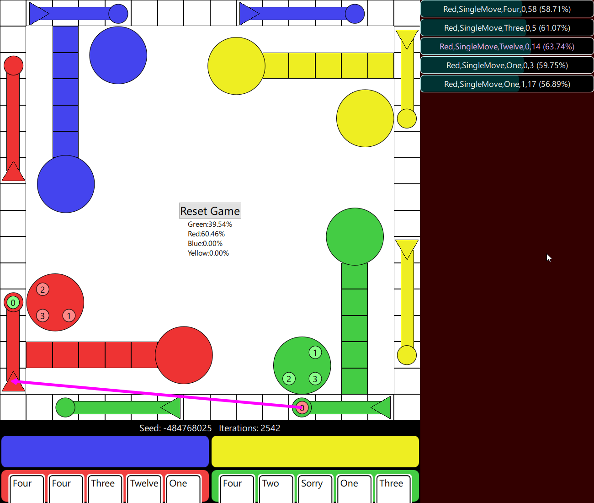
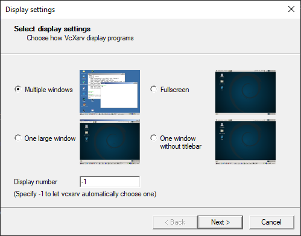
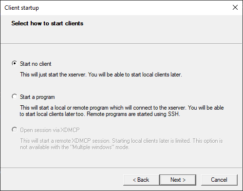
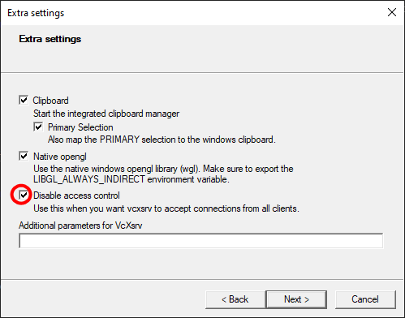
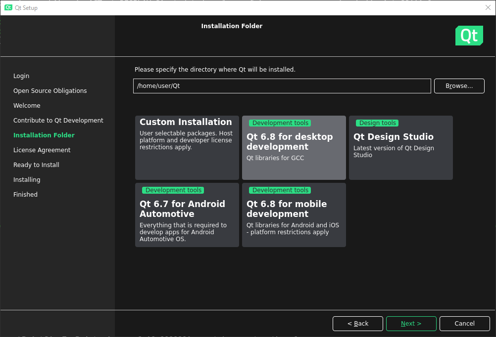

# Qt Sorry

This repository provides a UI for the board game Sorry along with visualization of a Monte Carlo Tree Search bot which can be played against as an opponent.

Make sure to clone the submodule for the Sorry and MCTS implementations.



# Building in Qt Creator

1. Open project in Qt Creator by selecting the CMakeLists.txt
2. Select a kit (this includes selecting a Qt version and compiler)
3. Click the green arrow to build & run

# Building on command line

```
mkdir build
cd build
cmake ../
cmake --build .
```

# Running In Ubuntu WSL2

The section below describes what is required to build and run this software in Ubuntu in WSL2 and have the UI displayed in Windows.

## Installation

A few Linux packages are required, I assume mainly because Ubuntu for WSL2 ships without many of the usual display packages. We'll also install an X server on Windows and Qt in Ubuntu.

### Linux Packages

The following Linux packages are required.
```
sudo apt install libgl1-mesa-dev libxcb-xinerama0 libxkbcommon-x11-0 libxcb-icccm4 libxcb-image0 libxcb-keysyms1 libxcb-randr0 libxcb-render-util0 libxcb-sync1 libxcb-xfixes0 libxcb-shape0 libx11-xcb1 libxcb-cursor0 libxcb-cursor-dev
```

### Display Forwarding

Set up display forwarding. I run a Windows X server (VcXsrv) and set my Linux display to use the address of the X server. First launch the X server in windows. If there is an option to enable control, disable that; this will remove the requirement for authentication. Here are the settings I use for VcXsrv:




Since WSL2 is effectively a virtual machine with a different IP address, `DISPLAY` needs to be set to the Windows address where the X server is running:

```
export DISPLAY=$(cat /etc/resolv.conf | grep nameserver | awk '{print $2}'):0
```

### Install Qt

Download Qt from the official website ([https://www.qt.io/download-qt-installer-oss](https://www.qt.io/download-qt-installer-oss)). Do not download Qt using `apt`.

Run the Qt installer. A Qt account will probably be required.

```
./qt-online-installer-linux-x64-4.8.1.run
```

Choose "Qt 6.8 for desktop development" or whatever version happens to be the latest.



### Clone This Repo

Make sure that when cloning, you also recursively clone any submodules. To do so, once you've cloned this, run the following from within the SorryQt directory.
```
git submodule update --init --recursive
```

## Building

To build this application, we'll use CMake. Make sure that CMake is aware of our Qt installation. Replace `<user>` in the following command with your linux username.
```
export CMAKE_PREFIX_PATH=/home/<user>/Qt/6.7.3/gcc_64:$CMAKE_PREFIX_PATH
```

Now run CMake & Make.
```
mkdir build
cd build
cmake ../
make
```

## Running

Before running the software, disable hardware acceleration. I was seeing a crash related to Nvidia drivers.

```
export QT_QUICK_BACKEND=software
```